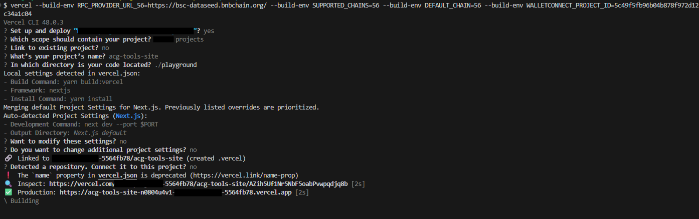

# ACG Tools Site

## Local build steps

1. Install nodejs from the [official website](https://nodejs.org/en/downloadhttps://nodejs.org/en/download)

   Then, install yarn as below

   ```bash
   npm install -g yarn
   ```

2. Install required packages

   ```bash
   yarn install
   ```

3. Build packages

   ```bash
   yarn build:packages
   ```

4. Go to `/playground` directory

   ```bash
   cd playground
   ```

5. Create `.env` from `.env.example`

   For `RPC_PROVIDER_URL_56`, it's recommended to replace the provided rpc with a reliable third-party rpc for a consistent & uninterrupted connection.

   For `WALLETCONNECT_PROJECT_ID`, retrieve the `projectId` from Reown dashboard

   ```bash
   cp .env.example .env
   ```

6. Launch dev app

   ```bash
   yarn dev
   ```

## Vercel Deployment (via CLI only)

1. Please make sure to execute step 1 through 6 under [Local build steps](#local-build-steps)

2. Login to your Vercel account in the browser

3. Install vercel cli (skip if you have already have vercel installed on your system)

   ```bash
   npm install -g vercel
   ```

4. Please make sure there's no `.vercel` directory in the root directory of the repository.

5. In the root directory of the repository, execute the below command to start the vercel deployment. Update the env variable according to `.env` before executing the command

   ```bash
   vercel deploy --prod --env RPC_PROVIDER_URL_56=https://bsc-dataseed.bnbchain.org/ --env SUPPORTED_CHAINS=56 --env DEFAULT_CHAIN=56 --env WALLETCONNECT_PROJECT_ID=5c49f5fb96b04b878f972d12c34a1c04
   ```

   Vercel will prompt for additional details on the deployment. Please follow as demonstrated in the image below.

   

6. Once the build is done, the site should be available at the deployed domain.
